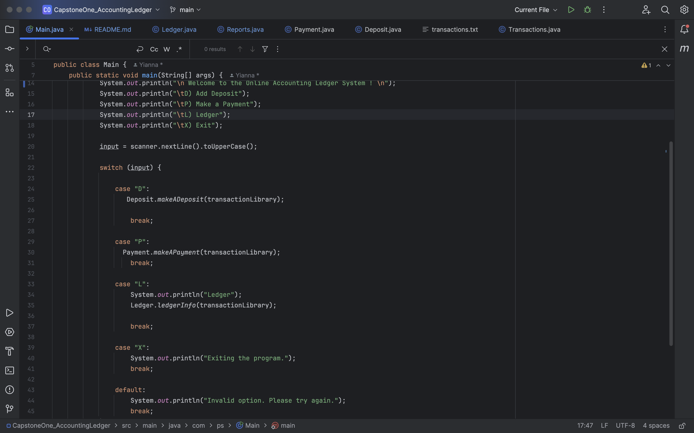
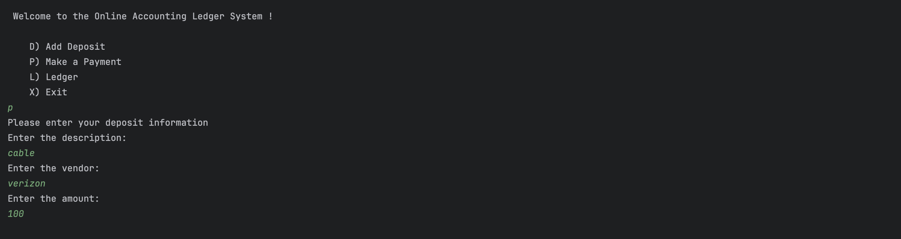
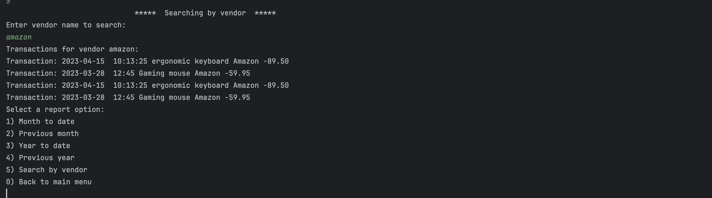

# CapstoneOne_AccountingLedger

## Understanding the problem

- Inputs
    - User input

- Outputs
    - Command-Line Interface (CLI)
    - Creating an application that allows the user to view all transactions, add transactions, and to see their reports 

## Making a plan
``
// Pseudocode
//Inputs
// Using Scanner to take an initial user menu command
// First welcoming the user to the online banking system, then allowing the user to decide if they want to add a deposit, make a payment, look at their ledger or exit the program.
// After the prompt the use will input a letter
// There will be a menu for each option except the exit option to allow the user to check out a product
// The ledger will have a menu for all entries, deposits, payments, reports and an option to return back to the home screen
// The reports option will have a submenu that will include  Month to date, Previous month , Year to date , Previous year , Search by vendor  and Back to main menu
// The application will print to the CLI the result of the user options
``

## Developers Favorite piece of code

This is my favorite piece of code because I was able to make my code more manageable and easier to read. I was able to pass the transaction library array down to the deposits, payment and ledger options. I made each method a class and called the class in the main method switch case.  

## SnapShots of the code working

### Home screen and deposit 

### Ledger 

### Payment screens

### Reports 

